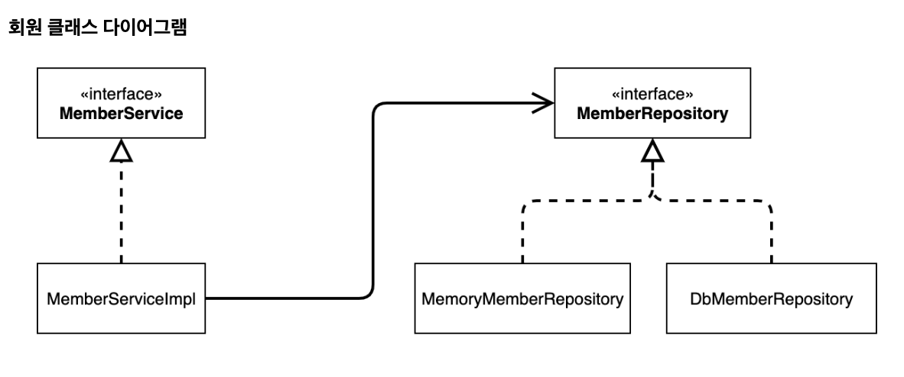
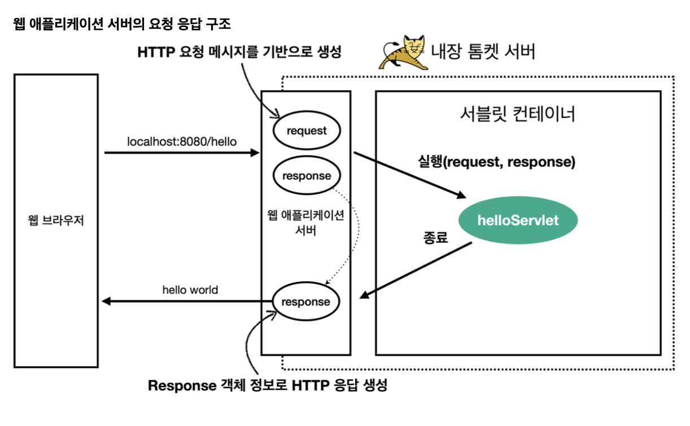

# spring-tutorial-22nd
CEOS 백엔드 22기 스프링 튜토리얼

# 1주차

### 1️⃣ spring-tutorial-22nd를 완료해요!

### 2️⃣ spring이 지원하는 기술들(IoC/DI, AOP, PSA 등)을 자유롭게 조사해요

### IoC/DI [제어의 역전/ 의존성 주입]

→ 오브젝트의 생명주기와 의존관계에 대한 프로그래밍 모델

### IoC(Inversion of Contorl / 제어의 역전)

(기존)   
클라이언트 구현 객체 → 필요한 서버 구현 객체 생성/연결/실행
Ex) 구현 객체 변경 시… 클라이언트 클래스 코드도 변경해야 함
SOLID → DIP(의존관계 역전 원칙) 위반, OCP(개방-폐쇄 원칙) 위반    


(현재) — AppConfig 등장   
구현 객체 → 부여된 로직 실행   
AppConfig → 프로그램의 제어 흐름 관리

Ex) 회원 도메인 개발


```java
public class MemberServiceImpl implements MemberService {

    private final MemberRepository memberRepository;

    public MemberServiceImpl(MemberRepository memberRepository) {
        this.memberRepository = memberRepository;
    }
    
}
```

```java
@Configuration
public class AppConfig {

    @Bean
    public MemberService memberService() {
        return new MemberServiceImpl(memberRepository());
    }

    @Bean
    public MemberRepository memberRepository() {
        return new MemoryMemberRepository();
    }
    
}
```

✓ 스프링이 제공하는 IoC 방법…

1. 의존관계 주입(Dependency Injection)
2. 의존관계 검색(Dependency Lookup)

✓ 스프링 컨테이너 생성

- XML 기반 생성
- ✅ 어노테이션 기반의 자바 설정 클래스(@Configuration)로 생성

  스프링 컨테이너 생성 → [스프링 빈 등록 → 스프링 빈 의존관계 설정]


```java
ApplicationContext applicationContext =
new AnnotationConfigApplicationContext(AppConfig.class);
```

### DI (Dependency Injection / 의존관계 주입)

애플리케이션 실행 시점에 외부에서 실제 구현객체를 생성하고 클라이언트에 전달하여, 클라이언트와 서버의 실제 의존관계가 연결되는 것

→ DI를 사용하면 클라이언트 코드를 변경하지 않고, 클라이언트의 호출 대상의 타입 인스턴스를 변경할 수 있다

→ DI를 사용하면 정적인 클래스 의존관계를 변경하지 않고, 동적인 객체 인스턴스 의존관계를 변경할 수 있다

✓ DI 의존성 주입 방법

1. filed 주입
2. Setter  주입

   객체의 생성 → 의존관계 주입

3. ✅ 생성자 주입

   객체의 생성 & 의존관계 주입 동시에 일어남


### AOP (Aspect-Oriented Programming / 관점 지향 프로그래밍)

실행 시간 측정, 로깅과 같은 횡단 관심사를 핵심 로직과 분리하는 프로그래밍 모델

→ 의존관계에 프록시 주입 (joinPoint.proceed())

-AOP 적용 전 의존관계 (예시)

memberController → memberService

-AOP 적용 후 의존관계 (예시)

memberController → (프록시) memberService → (실제) memberService

```java
@Aspect
@Component
public class TimeTraceAop {

    @Around("execution(* hello.hello_spring..*(..))")
    public Object execute(ProceedingJoinPoint joinPoint) throws Throwable {
    
        long start = System.currentTimeMillis();
        
        System.out.println("START: " + joinPoint.toString());
        
        try {
            return joinPoint.proceed();
        } finally {
            long finish = System.currentTimeMillis();
            long timeMs = finish - start;
            
            System.out.println("END: " + joinPoint.toString() + " " + timeMs + "ms");
        }

    }
}
```

### PSA (Portable Service Abstraction)

기술 구현체 변경에도 일관된 방식으로 접근할 수 있도록 하는 스프링 추상화 구조

→ @Transactional (예시)

스프링은 트랜젝션 방식을 추상화하여 JDBC, JTA, Hibernate 등 다양한 기술 스택에서 일관된 방식으로 동작하게 한다

```
애플리케이션 계층 -> 추상화 계층 -> 구체적인 트랜젝션 계층
```

JDBC 리포지토리 → JPA 리포지토리 로 변경하는 경우에도, Transation에 대한 처리는 동일하므로 트랜젝션 관리 코드는 그대로 유지할 수 있다

## 3️⃣ Spring Bean 이 무엇이고, Bean 의 라이프사이클과 Bean Scope에 대해 조사해요

### Spring Bean

스프링 컨테이너가 생성 및 관리하는 객체 (IoC 방식)

- 스프링 컨테이너 → 스프링 빈 관리 역할
    - 객체 생성 및 관리 : 스프링 컨테이너가 개발자 대신 객체를 만들어준다
    - 의존성 관리 : 스프링이 의존관계에 놓인 두 객체들을 자동으로 연결해준다
    - 객체 생애 주기 관리 : 스프링 빈의 생성·소멸 시 작업을 지정해두면 스프링이 처리해준다

- 스프링 빈 등록 방식
    - XML 설정 파일 <bean/> 등록
    - ✅ 컴포넌트 스캔과 자동 의존 관계 설정 (@Component,  @Autowired 등)

      *@Component → @Controller, @Service, @Repository 등..


```java
    @Controller // @Component 어노테이션 포함 -> 스프링 빈 자동 등록
    public class MemberController {
        private final MemberService memberService;
        
        @Autowired // 객체 생성 시점에 스프링 컨테이너에서 관련 빈을 찾아 주입 (DI)
        public MemberController(MemberService memberService) {
            this.memberService = memberService;
        }
    
    }
```    

    
- 자바 설정 클래스에서 빈 등록 (@Configuration, @Bean)
    
```java
    @Configuration
    public class AppConfig {
    
        @Bean
        public MemberService memberService() {
            return new MemberService(memberRepository());
        }
    
        @Bean
        public MemberRepository memberRepository() {
            return new MemoryMemberRepository();
        }
        
    }
```


### Bean LifeCycle [빈 생명주기]

```markup
스프링 IoC 컨테이너 생성 → [스프링 빈 생성 → 의존관계 주입] → (초기화 콜백 메서드 호출) → 사용 → (소멸 콜백 메서드 호출) → 스프링 종료
```

### +콜백 메서드

특정 이벤트가 발생했을 때 호출되는 메서드

- 빈 생명주기 콜백 관리
    - 인터페이스 (InitializingBean, DisposableBean)
        1. InitializingBean.afterPropertiesSet() - 초기화 콜백 메소드
        2. DisposableBean.destroy() - 소멸 콜백 메소드
    - 설정 파일(@Configuration)에 초기화 메서드, 종료 메서드 지정

      @Bean(initMethod = “ “, destroyMethod = “ “)

      → initMethod: 초기화 콜백 메소드, destroyMethod: 소멸 콜백 메소드

    - ✅ @PostConstruct @PreDestroy 어노테이션

    ```java
        public class ExampleBean {
        
        	@PostConstruct    
        	public void initialize() throws Exception {
        		// 초기화 콜백 (의존관계 주입이 끝나면 호출)    
        	}     
        	
        	@PreDestroy    
        	public void close() throws Exception {
        		// 소멸 전 콜백 (메모리 반납, 연결 종료와 같은 과정)
        	}
        	
        }
    ```


### Bean Scope [빈 스코프]

1. 싱글톤 스코프(Singleton Scope)

   디폴트 스코프, 스프링 컨테이너의 시작/종료까지 유지되는 범위의 스코프

2. 프로토타입 스코프(Prototype Scope)

   프로토타입 빈의 생성과 의존 관계 주입까지만 관여하는 스코프

3. 웹 관련 스코프
    - request: 웹 요청이 들어오고 나갈 때까지 유지되는 스코프
    - session: 웹 세션의 생성/종료까지 유지되는 스코프
    - application: 웹의 서블릿 컨텍스트와 같은 범위로 유지되는 스코프

### Annotation [어노테이션]

코드 사이에 특별한 의미, 기능을 수행하도록 하는 기술

→ Java 코드에 어노테이션을 추가하여, 스프링 프레임워크가 코드의 의미와 기능을 파악하고 처리하도록 한다

→ 컴포넌트 스캔, 의존성 주입, RESTful API 구축 등 다양한 기능을 구현할 수 있다

✓ Annotation 종류

@SpringBootApplication, @Configuration, @Component 등등..

### 스프링 어노테이션 기반 빈 등록 과정

1. 어노테이션 구성 소스 읽기
2. 컴포넌트 스캔 → 어노테이션 구성 소스에 @Component가 포함되어 있는가?
3. 스캔된 클래스 → 스프링 IoC 컨테이너에 빈 정의로 등록

### 스프링의 컴포넌트 탐색 과정 (@ComponentScan)

✓ @ComponentScan

@Component, @Service, @Repository, @Controller, @Configuration 이 붙은 빈을 찾아서 Context에 빈을 등록해준다

→ 애플리케이션 클래스 패키지 기준 하위를 스캔한다

### 4️⃣ 🔥Spring MVC를 심층 분석해요🔥

### MVC 패턴 VS Spring MVC

- MVC 패턴
    - Model-View-Controller 로 관심사를 분리하는 아키텍처 개념
    - Model: 데이터, 비즈니스 로직
    - View: 화면 표현
    - Controller: 사용자 입력 처리 및 Model-View 연결
- Spring MVC
    - MVC 패턴을 스프링에서 구현한 웹 프레임워크, 서블릿 위에 만들어진 패턴 (DispatcherServlet 중심)
    - 서블릿 코드 작성 없이 어노테이션 기반으로 MVC 구조 적용 가능

### Servlet[서블릿], 웹 요청 처리

자바로 웹 요청과 응답을 처리하기 위해 만든 표준 API

```
클라이언트의 HTTP 요청 
-> WAS가 Request, Response 객체를 새로 만들어 서블릿 객체 호출
-> Request 객체: HTTP 요청 정보 꺼냄, Response 객체에 HTTP 응답 정보 입력
-> WAS가 Response 객체 -> HTTP 응답 정보 생성
```

→ 자바 웹 애플리케이션의 기본 실행 단위

→ 서블릿 컨테이너 (ex. 톰캣) 위에서 실행된다

✓ 서블릿 등록(예시)

```java
@WebServlet(name = "helloServlet", urlPatterns = "/hello")
public class HelloServlet extends HttpServlet {

	// HTTP 요청을 통해 매핑된 URL이 호출되면 서블릿 컨테이너는 다음 메서드를 실행한다	
	@Override
	protected void service(HttpServletRequest request, HttpServletResponse
	response) { throws ServletException, IOException {
			System.out.println("HelloServlet.service");
			System.out.println("request = " + request);
			System.out.println("response = " + response);
			
			String username = request.getParameter("username");
			System.out.println("username = " + username);
			
			response.setContentType("text/plain");
			response.setCharacterEncoding("utf-8");
			response.getWriter().write("hello " + username);
		}
	}	
	
}
```

→ 웹 브라우저 실행

[http://localhost:8080/hello?username](http://localhost:8080/hello?username)=spring

결과: hello spring

### Tomcat(톰캣)

자바 서블릿과 자바 서버 페이지를 실행할 수 있는 웹 서버이자 서블릿 컨테이너

→ HTTP 프로토콜을 통해 클라이언트의 요청을 받으면, 서블릿 규격에 따라 자바 웹 애플리케이션을 실행하여 응답 반환



### WAS(Web Application Server / 웹 애플리케이션 서버)

HTTP 기반으로 동작하며, 애플리케이션 로직을 수행한다

→ 동적 HTML, HTTP API(JSON)

→ 서블릿, JSP, 스프링 MVC

### Dispatcher Servlet 동작 흐름

Spring MVC의 프런트 컨트롤러 서블릿

1. 클라이언트에서 HTTP 요청 → Dispatcher Servlet
2. **HandlerMapping을 통해 요청 URL에 매핑된** 핸들러 조회
3. 핸들러를 처리할 수 있는 핸들러 어댑터 조회 → 핸들러 어댑터 실행 → 핸들러 실행 → ModelAndView 반환
4. viewResolver 호출, Dispatcher Servlet으로 View 반환
5. View 렌더링
6. DispatcherServlet이 최종 HTML 응답 전송

✓ doDispatch()

DispatcherServlet의 메서드

스프링 MVC의 전체 요청 처리 흐름을 담당한다

```java
protected void doDispatch(HttpServletRequest request, HttpServletResponse response) throws Exception {
    // 1. 요청에 맞는 HandlerMapping 조회
    HandlerExecutionChain mappedHandler = getHandler(request);

    // 2. HandlerAdapter 조회 (컨트롤러 실행 방법 결정)
    HandlerAdapter ha = getHandlerAdapter(mappedHandler.getHandler());

    // 3. 인터셉터 preHandle 실행

    // 4. 실제 Controller 호출
    ModelAndView mv = ha.handle(request, response, mappedHandler.getHandler());

    // 5. ViewResolver 통해 View 찾기
    render(mv, request, response);

    // 6. 인터셉터 afterCompletion 실행
}

```